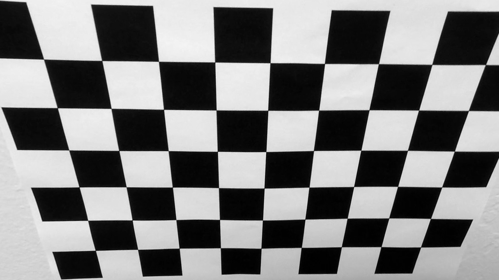
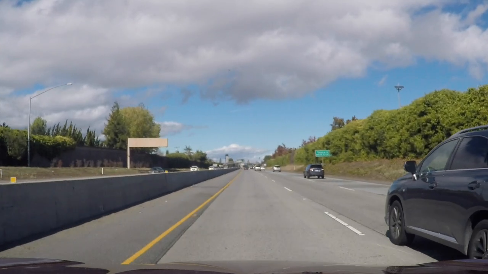
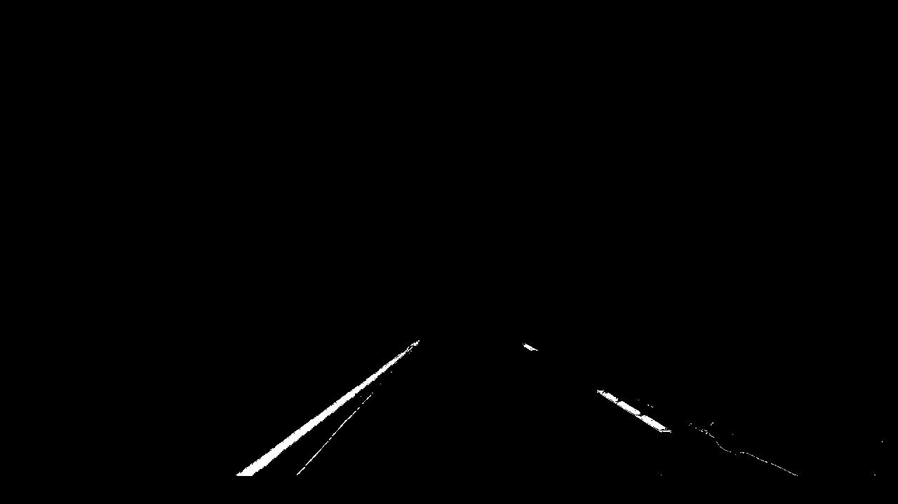
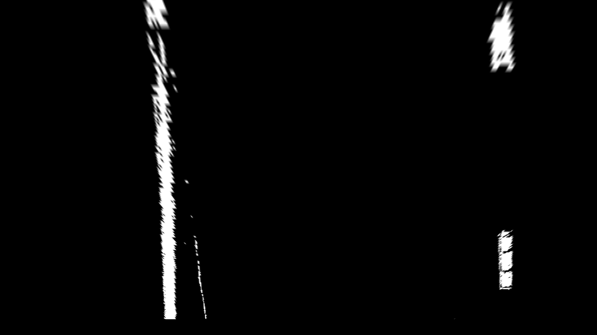
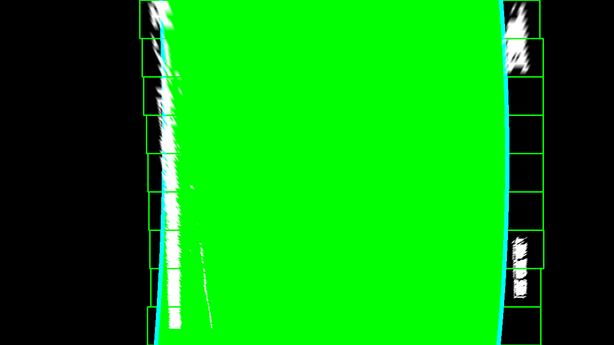

**Advanced Lane Finding Project**

The goals / steps of this project are the following:

* Compute the camera calibration matrix and distortion coefficients given a set of chessboard images.
* Apply a distortion correction to raw images.
* Use color transforms, gradients, etc., to create a thresholded binary image.
* Apply a perspective transform to rectify binary image ("birds-eye view").
* Detect lane pixels and fit to find the lane boundary.
* Determine the curvature of the lane and vehicle position with respect to center.
* Warp the detected lane boundaries back onto the original image.
* Output visual display of the lane boundaries and numerical estimation of lane curvature and vehicle position.

[//]: # (Image References)

[image1]: ./examples/undistort_output.png "Undistorted"
[image2]: ./test_images/test1.jpg "Road Transformed"
[image3]: ./examples/binary_combo_example.jpg "Binary Example"
[image4]: ./examples/warped_straight_lines.jpg "Warp Example"
[image5]: ./examples/color_fit_lines.jpg "Fit Visual"
[image6]: ./examples/example_output.jpg "Output"
[video1]: ./project_video.mp4 "Video"

## [Rubric](https://review.udacity.com/#!/rubrics/571/view) Points

### Here I will consider the rubric points individually and describe how I addressed each point in my implementation.  

---

### Camera Calibration

#### 1. Briefly state how you computed the camera matrix and distortion coefficients. Provide an example of a distortion corrected calibration image.

The camera calibration logic was implemented in the cam_calibration.py module of the project.
In main.py (line 42):
	ret, mtx, dist, rvecs, tvecs = cc.calibrate_cam() 
can be called to get the mtx and dist coeficients.
Lines 25 to 27 (currently commented) get those values and store them in mtx.dat and dist.dat files
to have them handy without the need to process them each time.

calibrate_cam() function (line 27 of cam_calibration.py) basically does the following:
1) Define nx = 9 and ny = 6
2) Walkthrouh all the calibration images
3) Call calibrate_cam_by_img(image_file, nx, ny, obj_points, img_points, obj_p, index) (line 9 of cam_calibration.py) on each iteration,
wich:
	a) Read Image
	b) Convert BGR to Gray
	c) Call ret, corners = cv2.findChessboardCorners(gray, (nx, ny), None) to get board corners 
	d) If corners were found then call:
		ret, mtx, dist, rvecs, tvecs = cv2.calibrateCamera(obj_points, img_points, gray.shape[::-1], None, None)
	e) And finally undistort: 
		dst = cv2.undistort(img, mtx, dist, None, mtx)

A test() function is also provided on this module (and all the others) to test individual images to tune the whole system
Check sample images in the next section.

### Pipeline (single images)

#### 1. Provide an example of a distortion-corrected image.

To demonstrate this step, I will describe how I apply the distortion correction to one of the test images like this one:
#### Distorted image:

After the process is described in detail in the previous section (Camera Calibration)
#### Corrected image:

#### 2. Describe how (and identify where in your code) you used color transforms, gradients or other methods to create a thresholded binary image.  Provide an example of a binary image result.

All the process for color and gradients is implemented in color_gradient.py module.
The main function is applygradients(img, ksize) (line 98 of this module), and does the following:
1) Add black masks for areas not required for this recognition (as everything on top of the horizon line and at the bottom 
   of the image where the car is displayed)
2) Creates a mask for colos near black (very dark gray range) to exclude those points (dark_mask_binary)
3) Converts BGR image in Gray scale
4) Get horiz and vert gradients (gradx and grady) 
   with the abs_sobel_thresh(gray_img, orient='x', sobel_kernel=3, thresh=(0, 255)) function (line 7)
   with a kernel size of 31 (top limit value)
5) values are normalized to 0 or 1 (binary image) based on a threshold range (30, 100), using cv2.Sobel function
6) Grad magnitude is calculated with mag_thresh(gray_img, sobel_kernel=3, mag_thresh=(0, 255)) based on a threshold range (30, 100), 
   function (line 30), using cv2.Sobel function
7) Calculate de gradient direction with dir_thresh(gray_img, sobel_kernel=3, thresh=(0, np.pi/2)) function, with (0.7, 1.3) range threshold
8) Apply a color filter converting BGR image to HLS color space and using a 200 as lower threshold for lightness channel and 
   66 for saturation channel 
9) Finally all the previous values are combined as follows:
	
	combined[(((gradx == 1) & (grady == 1)) | ((mag_binary == 1) & (dir_binary == 1)) | (channel_image == 1)) & (dark_mask_binary == 1)] = 255

#### Original image:
#### Binary color and gradient filtered image:

The result is an image as the following:

#### Binary color and gradient filtered image:

#### 3. Describe how (and identify where in your code) you performed a perspective transform and provide an example of a transformed image.

Perspective transform is implemented in the perspective_transform.py module.
transform_unwarp(image, inv=False, mask=True) function call 
	M = cv2.getPerspectiveTransform(src, dst)
	or
	M = cv2.getPerspectiveTransform(dst, src)

To get the bird eye view or to return to the original perspective view.

The transformed image is returned calling warped_img = cv2.warpPerspective(image, M, img_size)
and passing transformation matrix M, that was calculated in the previous step.

The following is a sample of a top view transformation:

#### Top view transformation result:

The src and dst points where got comparing images in an image editor 
with certain elements that where used for referrence between the 2 images,
which resulted in the following source and destination points:

    src = np.float32([(304, 700), 
					  (575, 505), 
					  (770, 505), 
					  (1082, 700)])

    dst = np.float32([[350, 700], 
                      [350, 200], 
                      [1082, 200], 
                      [1082, 700]])   

I verified that my perspective transform was working as expected by drawing the `src` and `dst` points 
onto a test image and its warped counterpart to verify that the lines appear parallel in the warped image.

#### 4. Describe how (and identify where in your code) you identified lane-line pixels and fit their positions with a polynomial?

The lines identification logic is in the lanes_detection.py module.
Its entry point is the detect_lanes(warped_thres_img, image, detection) (line 40 fo this module)
The transformed (top view) image was divided into 9 horizontal bands and a loop walk through them,
and based on histogram data:

histogram = np.sum(warped[warped.shape[0]//2:,:], axis=0)

search with size 40 * 80 and a margin of 50 to limit slide.
This loop start in line 73, and the output is a group of points (left_lane_inds and right_lane_inds)
Using np.polyfit(., ., 2) function to get a second order curve, which is then used as a continuos lane
for both left and right sides. 

The following image illustrates the process:

#### Top view lines detection:

validate_lines(ploty, left_fitx, right_fitx) is called to get curve radious and 
validations are perform for:
1) radius
2) bottom lanes separation
3) top lanes separations

#### 5. Describe how (and identify where in your code) you calculated the radius of curvature of the lane and the position of the vehicle with respect to center.

I did this in lines # through # in my code in `my_other_file.py`

#### 6. Provide an example image of your result plotted back down onto the road such that the lane area is identified clearly.

I implemented this step in lines # through # in my code in `yet_another_file.py` in the function `map_lane()`.  Here is an example of my result on a test image:

![alt text][image6]

---

### Pipeline (video)

#### 1. Provide a link to your final video output.  Your pipeline should perform reasonably well on the entire project video (wobbly lines are ok but no catastrophic failures that would cause the car to drive off the road!).

Here's a [link to my video result](./project_video.mp4)

---

### Discussion

#### 1. Briefly discuss any problems / issues you faced in your implementation of this project.  Where will your pipeline likely fail?  What could you do to make it more robust?

Here I'll talk about the approach I took, what techniques I used, what worked and why, where the pipeline might fail and how I might improve it if I were going to pursue this project further.  
